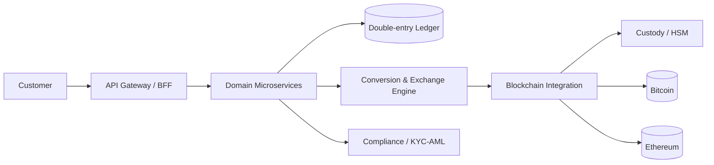

# CryptoBank

> A crypto-native digital bank. Everything a traditional bank offers — accounts, transfers, payments, investments and financing — with cryptocurrency at its core, and seamless conversion between fiat (USD, EUR, BRL) and crypto. **BTC** and **ETH** at launch.

Built with **Python 3.12** and **FastAPI**.

---

## What CryptoBank is

CryptoBank lets customers:

- Open multi-currency accounts (fiat + crypto).
- Deposit and withdraw crypto to/from external blockchain addresses.
- **Convert** fiat ↔ crypto and crypto ↔ crypto at a quoted rate.
- Send instant internal transfers to other CryptoBank customers.
- Invest (staking / yield products).
- Finance assets via crypto-collateralized loans.
- Use everyday financial services (statements, fees, notifications).

The bank uses a **custodial model**: it securely holds private keys (via HSM/KMS), so customers get a familiar banking experience without managing keys themselves.

---

## Documentation index

| Document | Description |
|----------|-------------|
| [`ARCHITECTURE.md`](./ARCHITECTURE.md) | The full Solution Architecture Document: contexts, flows, data, security, compliance, infrastructure. |
| `README.md` (this file) | Project overview, conventions, and how to run locally. |

Start with **`ARCHITECTURE.md`** for the complete design.

---

## Architecture at a glance



Core ideas:

- **Ledger is the single source of truth** — immutable, double-entry, integer-only money.
- **Off-chain first, on-chain at the edge** — internal transfers are instant ledger postings; the blockchain is touched only for deposits/withdrawals.
- **Event-driven microservices** organized by DDD bounded contexts.
- **Compliance and security are first-class**, not add-ons.

---

## Technology stack

- **Runtime:** Python 3.12
- **API:** FastAPI (ASGI), Pydantic v2
- **Databases:** PostgreSQL (ledger/transactional), Redis (cache/locks)
- **Messaging:** Apache Kafka (domain events, sagas)
- **Blockchain:** Bitcoin & Ethereum nodes/providers behind a chain-abstraction layer
- **Custody:** HSM/KMS + dedicated Signing Service
- **Infra:** Docker, Kubernetes, Terraform, OpenTelemetry/Prometheus/Grafana

---

## Suggested repository layout

```
cryptobank/
├── services/
│   ├── identity/                 # AuthN/AuthZ, OAuth2/OIDC, MFA
│   ├── onboarding-kyc/           # registration + KYC/AML
│   ├── accounts-wallets/         # fiat accounts + custodial crypto wallets
│   ├── ledger/                   # double-entry accounting (source of truth)
│   ├── transactions/             # internal transfers, transaction lifecycle
│   ├── payments/                 # fiat rails (PIX/SEPA/SWIFT via PSP)
│   ├── exchange/                 # conversion & exchange engine
│   ├── market-data/              # pricing & spreads
│   ├── blockchain/               # chain adapters (BTC, ETH)
│   ├── custody/                  # signing service (talks to HSM)
│   ├── investments/              # staking / yield / portfolios
│   ├── lending/                  # crypto-collateralized loans
│   ├── compliance/               # monitoring, screening, travel rule
│   ├── notifications/            # email / SMS / push
│   └── audit/                    # immutable audit & reporting
├── libs/
│   ├── money/                    # integer-money types (cents, satoshis, wei)
│   ├── events/                   # event schemas + outbox helpers
│   └── common/                   # config, logging, tracing, errors
├── deploy/
│   ├── k8s/                      # manifests / Helm charts
│   └── terraform/                # infrastructure as code
└── docs/
    ├── ARCHITECTURE.md
    └── adr/                      # Architecture Decision Records
```

Each service follows **hexagonal architecture**: a domain core isolated from adapters (HTTP, DB, messaging, chain providers).

---

## Conventions

- **Money is an integer.** Always store amounts in the smallest unit (cents, satoshis, wei) with explicit `currency` + `scale`. Never use floats for money.
- **Idempotency-Key** header is mandatory on all state-changing financial endpoints.
- **Database-per-service.** No shared schemas across contexts.
- **Outbox pattern** for publishing domain events atomically with state changes.
- **Async-first** FastAPI endpoints (`async def`) for all I/O-bound work.
- **No secrets in code.** Use Vault; private keys never leave the HSM.

---

## Local development (illustrative)

> The commands below illustrate the intended developer experience for a single service. Adapt per service.

```bash
# Requirements: Python 3.12, Docker, docker compose

# 1. Bring up infra (Postgres, Redis, Kafka, local chain nodes/mocks)
docker compose up -d

# 2. Create and activate a virtual environment
python3.12 -m venv .venv && source .venv/bin/activate

# 3. Install dependencies
pip install -r requirements.txt

# 4. Run database migrations
alembic upgrade head

# 5. Start the service (example: exchange engine)
uvicorn services.exchange.main:app --reload --port 8080
```

Interactive API docs are then available at `http://localhost:8080/docs` (FastAPI / OpenAPI).

---

## Status

This repository currently contains the **solution architecture and core documentation**. Implementation follows the phased roadmap described in `ARCHITECTURE.md` (§19).

---

## A note on regulation

CryptoBank operates as a regulated financial entity. KYC/AML, sanctions screening, the travel rule and auditability are designed into the platform. Licensing and jurisdiction-specific obligations are handled at the corporate level and drive configuration of the compliance gates.