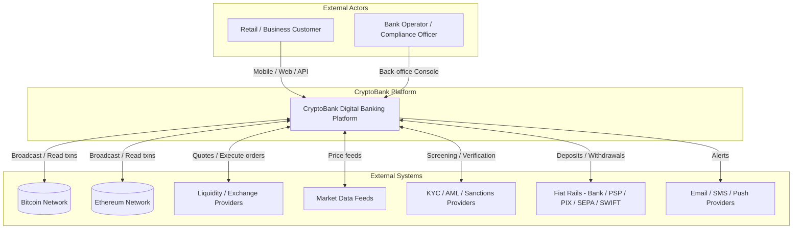
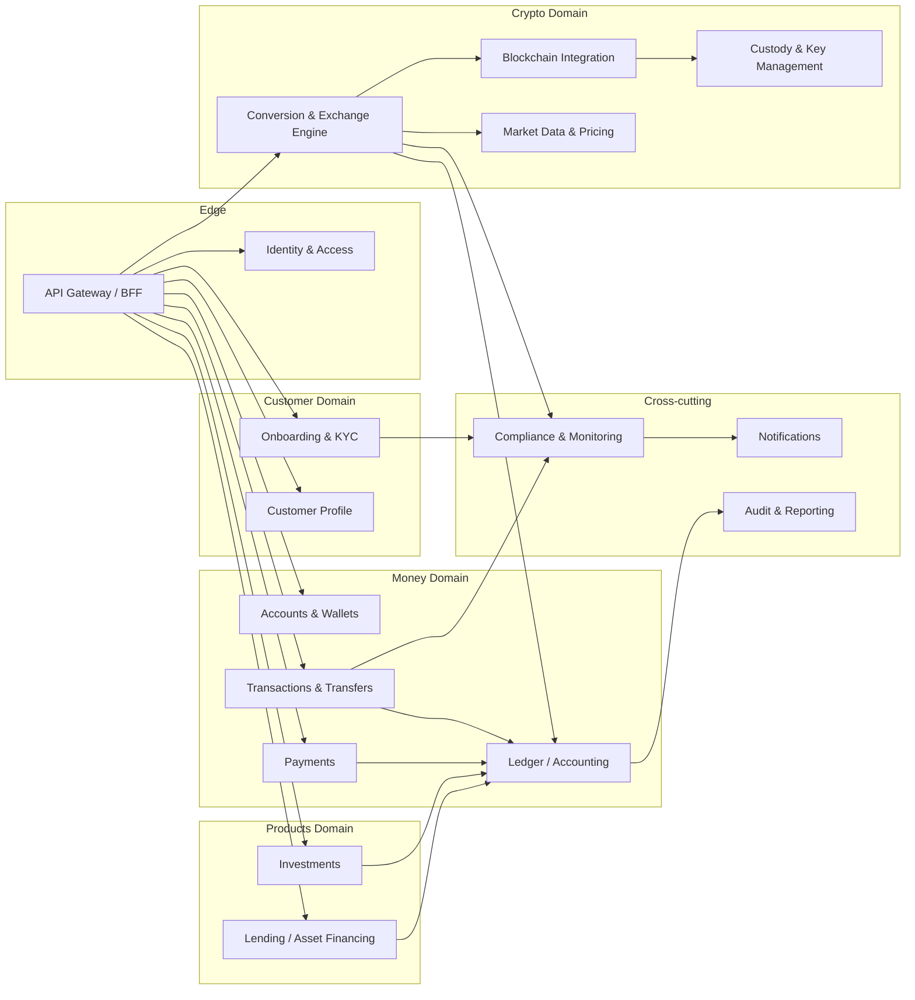
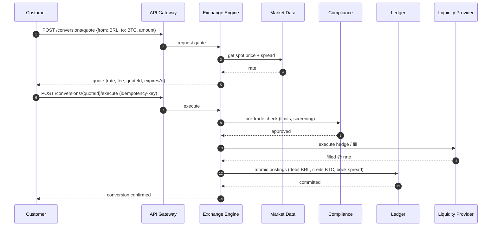
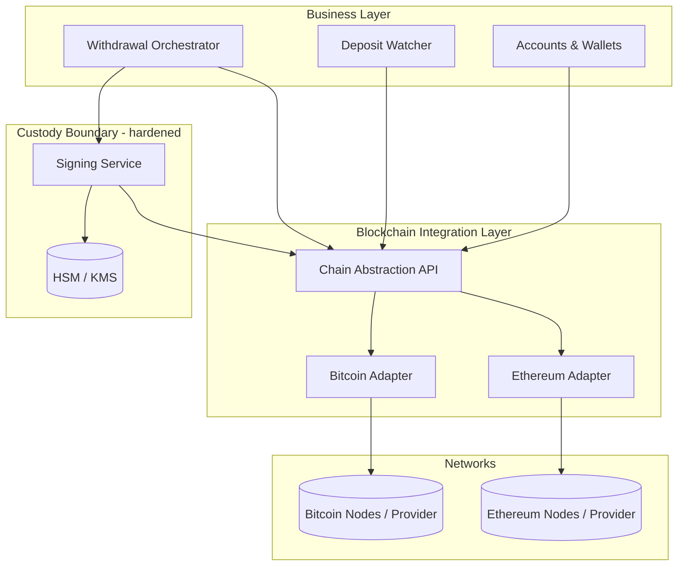
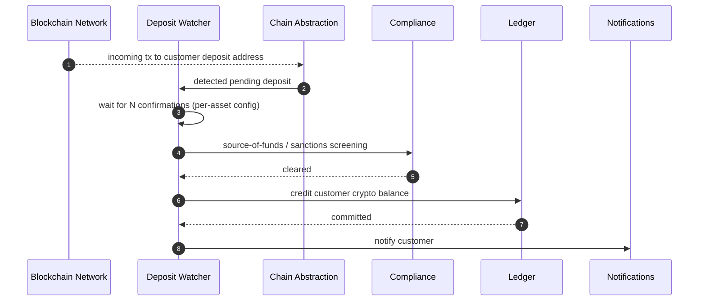
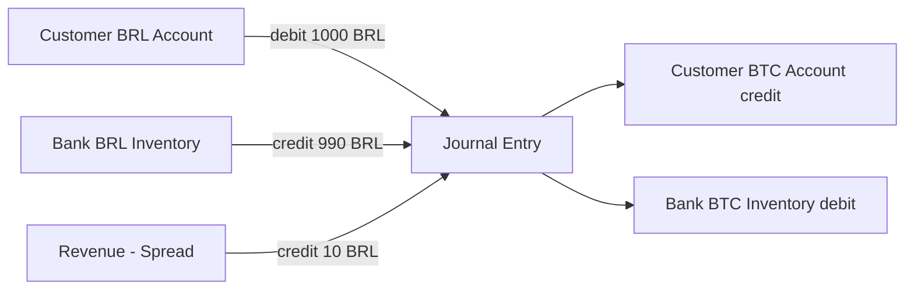
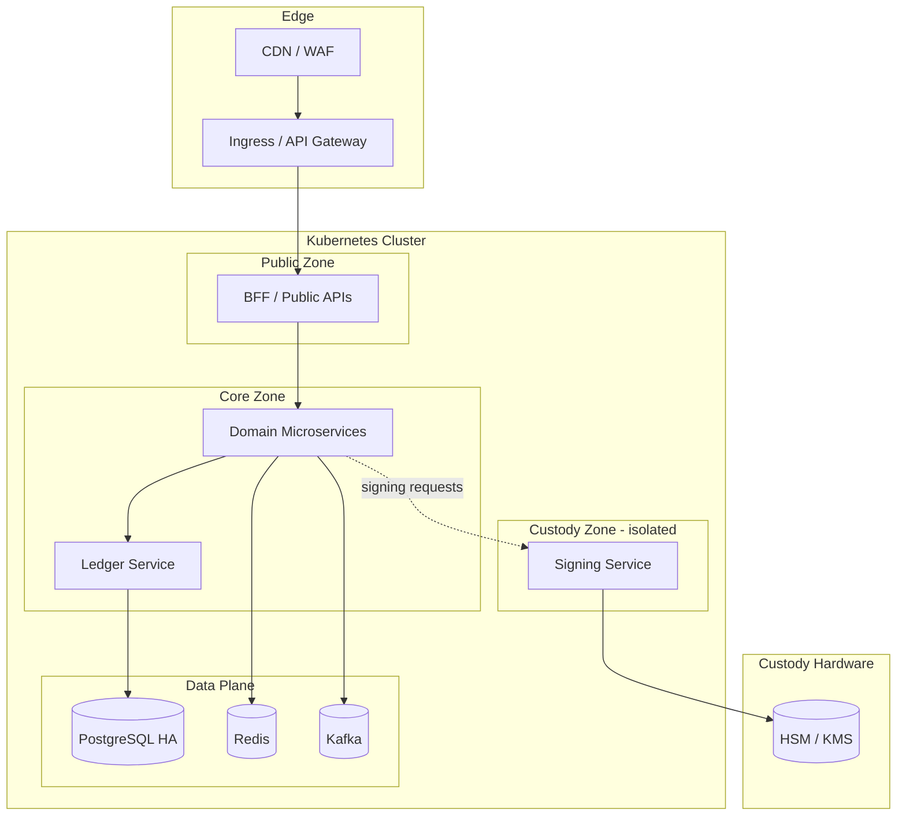

# CryptoBank — Solution Architecture Document (SAD)

**Project:** CryptoBank — Crypto-native Digital Banking Platform
**Version:** 1.0
**Status:** Draft for Review
**Owner:** Platform Architecture
**Last updated:** 2026-05-30

---

## 1. Purpose & Audience

This Solution Architecture Document (SAD) describes the target architecture for **CryptoBank**, a digital bank whose core ledger and value movement are based on cryptocurrencies, while still offering the full experience of a traditional bank: deposits, transfers, payments, investments, asset financing and other financial services.

The differentiator is that fiat money (USD, EUR, BRL) can be converted into crypto and back, with **Bitcoin (BTC)** and **Ethereum (ETH)** supported at launch.

The document targets: solution & enterprise architects, backend engineers, security & compliance officers, SRE/DevOps, and technical product owners.

---

## 2. Executive Summary

CryptoBank is built as a **cloud-native, event-driven microservices platform** written in **Python 3.12 + FastAPI**, organized around Domain-Driven Design (DDD) bounded contexts and a strict **double-entry ledger** as the single source of financial truth.

Key architectural pillars:

- **Custodial wallet model** at launch — the bank holds and secures private keys via an HSM/KMS, so customers get a bank-grade UX without managing keys themselves.
- **Internal double-entry ledger** denominated in a base unit, decoupled from on-chain settlement. Most customer-to-customer movements settle instantly off-chain; on-chain transactions happen only at the network boundary (deposits/withdrawals).
- **Conversion & Exchange engine** that prices and executes fiat↔crypto and crypto↔crypto conversions, backed by liquidity providers and market-data feeds.
- **Compliance-by-design**: KYC/AML, sanctions screening, travel-rule support and transaction monitoring are first-class services, not afterthoughts.
- **Security-first**: zero-trust networking, encryption everywhere, key custody isolated in a dedicated, hardened domain.

---

## 3. Goals, Scope & Constraints

### 3.1 In Scope (Phase 1)

- Customer onboarding with KYC/AML.
- Multi-currency accounts: fiat balances (USD, EUR, BRL) and crypto balances (BTC, ETH).
- Custodial crypto wallets with deposit and withdrawal to/from external blockchain addresses.
- Fiat↔crypto and crypto↔crypto conversion.
- Internal transfers (instant, off-chain) between CryptoBank customers.
- Investments (crypto staking/yield products, simple buy/hold portfolios).
- Asset financing / lending (crypto-collateralized loans).
- Core financial services: statements, fees, notifications, cards (roadmap).

### 3.2 Out of Scope (Phase 1)

- Non-custodial / self-custody wallets.
- Tokens other than native BTC and ETH (ERC-20 support is a Phase 2 candidate).
- Physical branches and cash handling.
- Full brokerage / securities trading of traditional assets.

### 3.3 Constraints & Assumptions

- Primary stack is **Python 3.12 + FastAPI**; performance-critical paths may use async I/O and, where justified, native extensions.
- The platform is **regulated**; licensing (banking / e-money / VASP) is assumed to be handled at the corporate level and drives compliance requirements.
- Crypto network finality is probabilistic (BTC) — confirmation thresholds are a configuration concern, not a code change.
- All monetary amounts are stored as integers in the smallest unit (cents, satoshis, wei) — **never floats**.

---

## 4. Architecture Principles

| # | Principle | Implication |
|---|-----------|-------------|
| P1 | **Ledger is the source of truth** | No service computes balances independently; all balance changes go through the ledger as immutable, double-entry postings. |
| P2 | **Off-chain first, on-chain at the edge** | Internal movements are instant ledger postings; the blockchain is touched only for external deposits/withdrawals. |
| P3 | **Compliance by design** | A transaction cannot complete without passing the relevant compliance gates. |
| P4 | **Zero trust** | Every service authenticates and authorizes every request; no implicit network trust. |
| P5 | **Keys are sacred and isolated** | Private keys never leave the custody/HSM boundary; signing is a service, not a library call in business code. |
| P6 | **Idempotency everywhere** | All financial commands carry idempotency keys; retries never double-spend. |
| P7 | **Event-driven & eventually consistent** | Cross-context communication is asynchronous via an event bus; sagas coordinate multi-step flows. |
| P8 | **Everything is observable & auditable** | Every financial event is logged, traced and immutably auditable. |
| P9 | **Money is an integer** | Decimal/integer arithmetic only; explicit currency + scale; no floating-point money. |

---

## 5. High-Level System Context (C4 — Level 1)



---

## 6. Logical Architecture — Bounded Contexts

CryptoBank is decomposed into bounded contexts. Each owns its data and exposes APIs + emits domain events.



### 6.1 Context Responsibilities

| Context | Responsibility | Owns |
|---------|----------------|------|
| **Identity & Access** | AuthN/AuthZ, OAuth2/OIDC, MFA, sessions, API keys, scopes | Users, credentials, roles |
| **Onboarding & KYC** | Registration, document capture, identity verification, risk scoring | Onboarding cases, verification status |
| **Customer Profile** | Customer master data, limits, preferences | Customer entity |
| **Accounts & Wallets** | Fiat accounts + custodial crypto wallets, balance views, deposit addresses | Accounts, wallets, addresses |
| **Ledger / Accounting** | Immutable double-entry postings; authoritative balances | Journal, postings, balances |
| **Transactions & Transfers** | Internal transfers, transaction lifecycle, idempotency | Transactions, transfer orders |
| **Payments** | Outbound/inbound fiat payments via PSP/PIX/SEPA/SWIFT | Payment orders |
| **Conversion & Exchange Engine** | Quoting, FX & crypto pricing, order execution, settlement against liquidity | Quotes, conversion orders, trades |
| **Custody & Key Management** | Key generation, secure storage, transaction signing, address derivation | Keys (HSM-bound), signing policies |
| **Blockchain Integration** | Node/provider access, broadcast, confirmation tracking, reorg handling | On-chain txns, confirmations |
| **Market Data & Pricing** | Real-time prices, spreads, rate cards | Price snapshots |
| **Investments** | Staking, yield products, portfolios | Positions, products |
| **Lending / Asset Financing** | Crypto-collateralized loans, LTV, liquidation | Loans, collateral, schedules |
| **Compliance & Monitoring** | KYC gating, sanctions/PEP screening, transaction monitoring, travel rule, SARs | Cases, alerts, rules |
| **Notifications** | Multi-channel customer & ops messaging | Templates, delivery logs |
| **Audit & Reporting** | Immutable audit trail, regulatory & financial reports | Audit log, report jobs |

---

## 7. The Crypto Differentiator — Conversion & Exchange Engine

This is the heart of CryptoBank. It turns "a bank" into "a crypto bank".

### 7.1 Responsibilities

- Produce **quotes** for fiat↔crypto and crypto↔crypto with a configurable spread/fee.
- Lock a quote for a short TTL (e.g., 10–30s) so the customer trades at a known rate.
- Execute the conversion: hedge/settle against one or more **liquidity providers**, or net internally against the bank's inventory book.
- Emit ledger postings atomically: debit the source currency, credit the target currency, book spread/fees as revenue.

### 7.2 Conversion Flow (fiat BRL → BTC)



### 7.3 Inventory & Risk

- The bank maintains **inventory books** per asset; the engine can net trades internally before hedging externally.
- A **risk/position service** monitors exposure and triggers re-hedging when thresholds are breached.
- Quotes are never honored after TTL expiry — stale execution requests are rejected and re-quoted.

---

## 8. Blockchain Integration & Custody

### 8.1 Layered Design



### 8.2 Chain Abstraction

A unified internal interface hides per-chain differences (UTXO vs account model, fee estimation, address formats, confirmation semantics). Adding a new chain means adding an adapter, not changing business logic.

```python
# Conceptual interface — not production code
class ChainAdapter(Protocol):
    async def derive_address(self, account_id: str) -> Address: ...
    async def estimate_fee(self, tx: DraftTx) -> Fee: ...
    async def build_unsigned_tx(self, intent: WithdrawalIntent) -> UnsignedTx: ...
    async def broadcast(self, signed_tx: SignedTx) -> TxHash: ...
    async def get_confirmations(self, tx_hash: TxHash) -> int: ...
```

### 8.3 Deposit Flow (on-chain → ledger credit)



### 8.4 Custody & Key Management Rules

- Private keys are generated and stored **only** inside the HSM/KMS; they are never exported in plaintext.
- Business services request **signatures**, not keys: the Signing Service enforces policy (amount thresholds, allow-lists, dual control for large amounts) before signing.
- Cold/warm/hot wallet tiering: the majority of funds sit in cold storage; only operational liquidity is hot.
- Withdrawal above a threshold requires multi-party approval (m-of-n) and/or time-locks.

---

## 9. Ledger & Accounting

The ledger is an **append-only, immutable, double-entry** system. Every financial event produces balanced postings (sum of debits = sum of credits).

Key rules:

- Amounts are integers in the smallest unit; each posting records `currency` and `scale`.
- Balances are **derived** from postings (with periodic snapshots for performance), never edited directly.
- Each posting set is written in a single database transaction and is idempotent on the command's idempotency key.
- Multi-currency transactions (e.g., a conversion) are modeled as multiple legs that net to zero per currency, with spread/fees posted to revenue accounts.



---

## 10. Data Architecture

| Concern | Technology | Rationale |
|---------|-----------|-----------|
| Ledger & transactional data | **PostgreSQL** (with strong constraints, serializable where needed) | ACID guarantees for money |
| Caching, rate limiting, quote locks, sessions | **Redis** | Low-latency ephemeral state |
| Event streaming / async messaging | **Apache Kafka** (or RabbitMQ) | Durable, ordered domain events; sagas |
| Document storage (KYC docs) | **Object storage** (S3-compatible), encrypted | Large binary, lifecycle policies |
| Search & monitoring queries | **OpenSearch / Elasticsearch** | Compliance/transaction search |
| Analytics / data lake | Columnar warehouse (e.g., BigQuery/Snowflake) | Reporting, ML for fraud/AML |
| Secrets & keys | **Vault** + **HSM/KMS** | Secret management & key custody |

Patterns:

- **Database-per-service**; no shared schemas between contexts.
- **Outbox pattern** to publish domain events atomically with state changes.
- **CQRS** for read-heavy contexts (balances, statements) using projections built from events.

---

## 11. API Design (FastAPI)

- **REST + JSON** as the primary external contract, with OpenAPI auto-generated by FastAPI.
- **Async-first** endpoints (`async def`) to maximize I/O concurrency (DB, chain providers, liquidity APIs).
- **Pydantic v2** models for request/response validation and serialization.
- **Idempotency-Key** header required on all state-changing financial endpoints.
- **API versioning** via URL prefix (`/v1/...`).
- **Pagination, filtering and consistent error envelopes** across services.
- **Webhooks** for asynchronous events to clients (deposit confirmed, conversion settled).

Representative resources:

```
POST   /v1/onboarding                      # start onboarding + KYC
GET    /v1/accounts                         # list fiat + crypto accounts
POST   /v1/wallets/{asset}/deposit-address  # get/generate deposit address
POST   /v1/transfers                        # internal instant transfer
POST   /v1/conversions/quote                # get fiat<->crypto quote
POST   /v1/conversions/{quoteId}/execute    # execute conversion
POST   /v1/withdrawals                       # on-chain withdrawal
POST   /v1/investments/positions            # open investment position
POST   /v1/loans                             # request crypto-collateralized loan
GET    /v1/statements                        # account statements
```

---

## 12. Security Architecture

- **Identity:** OAuth2 / OIDC, short-lived JWT access tokens + refresh tokens, MFA for sensitive operations, step-up auth for withdrawals.
- **Authorization:** fine-grained RBAC/ABAC; least privilege; scopes per token.
- **Zero trust:** mTLS between services; service identities; no implicit network trust.
- **Encryption:** TLS 1.3 in transit; field-level encryption for PII; encryption at rest for all stores.
- **Key custody:** isolated custody domain; HSM-backed signing; no private key material in application memory or logs.
- **Secrets:** centralized in Vault with rotation; no secrets in code or env files committed to VCS.
- **Application security:** input validation via Pydantic, rate limiting, WAF at the edge, dependency scanning, SAST/DAST in CI.
- **Anti-fraud:** velocity checks, device fingerprinting, anomaly detection feeding the compliance engine.
- **Tenant isolation & data minimization** for PII; GDPR/LGPD aligned data handling.

---

## 13. Compliance & Regulatory

Compliance is enforced as **gates** in business flows, not optional checks:

- **KYC/KYB** at onboarding with identity verification and document checks.
- **AML transaction monitoring**: rules + risk scoring on flows; alerting and case management.
- **Sanctions / PEP screening** on customers and counterparties.
- **Travel Rule** support for qualifying crypto transfers (originator/beneficiary data exchange).
- **Source-of-funds** checks on inbound crypto deposits.
- **Auditability**: every decision (approved/blocked) is logged immutably with reason codes.
- **Reporting**: SAR/STR generation, regulatory reporting jobs.

A transaction crosses compliance gates **before** the ledger commits when the gate is blocking, or asynchronously with hold/reversal where allowed.

---

## 14. Technology Stack

| Layer | Choice |
|-------|--------|
| Language / Runtime | **Python 3.12** |
| Web framework | **FastAPI** (ASGI, Uvicorn/Gunicorn) |
| Validation/Serialization | **Pydantic v2** |
| Async DB access | SQLAlchemy 2.x (async) / asyncpg |
| Relational DB | PostgreSQL |
| Cache / ephemeral | Redis |
| Messaging / events | Apache Kafka (or RabbitMQ) |
| Task processing | Celery / Arq / Faust-style consumers |
| Object storage | S3-compatible |
| Secrets / keys | HashiCorp Vault + HSM/KMS |
| Blockchain access | Self-hosted nodes and/or providers (e.g., Bitcoin Core, Geth/Erigon; Infura/Alchemy/QuickNode) |
| Containerization | Docker |
| Orchestration | Kubernetes |
| CI/CD | GitOps pipeline (build, test, scan, deploy) |
| Observability | OpenTelemetry, Prometheus, Grafana, centralized logging, distributed tracing |
| IaC | Terraform |

---

## 15. Deployment & Infrastructure



- **Network segmentation**: the custody zone is the most restricted; only the Signing Service may reach the HSM, and only specific services may reach the Signing Service.
- **High availability**: multi-AZ Postgres with replication, stateless services horizontally scaled, Kafka replicated.
- **Disaster recovery**: documented RPO/RTO, regular restore drills, geographically separate backups; key material backed up per HSM vendor procedures.

---

## 16. Non-Functional Requirements

| Attribute | Target / Approach |
|-----------|-------------------|
| **Availability** | 99.9%+ for core money paths; graceful degradation when chain providers are slow |
| **Consistency** | Strong within the ledger; eventual across contexts via events |
| **Latency** | Sub-second internal transfers; quotes returned in < 300 ms typical |
| **Scalability** | Horizontal scaling of stateless services; partitioned Kafka topics; read projections for heavy reads |
| **Durability** | No financial event ever lost; outbox + replicated stores |
| **Auditability** | Full immutable trail of every financial decision |
| **Recoverability** | Defined RPO/RTO; idempotent replay of events |
| **Security** | Covered in §12; continuous scanning, least privilege |

---

## 17. Resilience & Reliability Patterns

- **Idempotency keys** on all financial commands; safe retries.
- **Saga / orchestration** for multi-step flows (conversion = quote → compliance → execute → settle → post).
- **Outbox + event replay** to recover from partial failures.
- **Circuit breakers, retries with backoff, timeouts** on external dependencies (chain providers, liquidity, PSPs).
- **Dead-letter queues** for poison messages with operational tooling to inspect/replay.
- **Reorg handling**: deposits credited only after configurable confirmation depth; logic to reverse credits if a deep reorg invalidates a transaction.

---

## 18. Key Risks & Mitigations

| Risk | Impact | Mitigation |
|------|--------|------------|
| Private key compromise | Catastrophic loss of funds | HSM custody, cold storage majority, m-of-n approvals, allow-lists |
| Crypto price volatility on inventory | Financial loss | Real-time position monitoring, hedging, quote TTLs |
| Chain reorg / double-spend | Incorrect credits | Confirmation thresholds, reversal logic |
| Liquidity provider outage | Conversions fail | Multi-provider failover, internal inventory netting |
| Regulatory non-compliance | Legal/fines/shutdown | Compliance-by-design gates, audit trail, travel-rule support |
| Floating-point money bugs | Reconciliation errors | Integer-only amounts, ledger invariants, automated reconciliation |
| Double-spend via retries | Loss | Idempotency keys, ledger uniqueness constraints |

---

## 19. Delivery Roadmap (suggested)

1. **Phase 0 — Foundations:** identity, ledger, accounts, observability, CI/CD, custody/HSM integration.
2. **Phase 1 — Crypto core:** BTC + ETH deposits/withdrawals, conversion engine, internal transfers, KYC/AML.
3. **Phase 2 — Products:** investments (staking/yield), crypto-collateralized lending, cards, ERC-20 tokens.
4. **Phase 3 — Scale & optionality:** additional chains, additional fiat rails, advanced fraud/AML ML, self-custody option.

---

## 20. Glossary

- **Custodial wallet** — wallet whose private keys are held and managed by the bank.
- **HSM** — Hardware Security Module; tamper-resistant device for key storage and signing.
- **Double-entry ledger** — accounting method where every entry has equal debits and credits.
- **Off-chain** — value movement recorded only in the internal ledger, not broadcast to a blockchain.
- **On-chain** — a transaction broadcast to and settled on the blockchain network.
- **Travel Rule** — regulatory requirement to share originator/beneficiary info on qualifying transfers.
- **LTV** — Loan-to-Value ratio for collateralized lending.
- **Reorg** — blockchain reorganization that can invalidate previously seen transactions.
